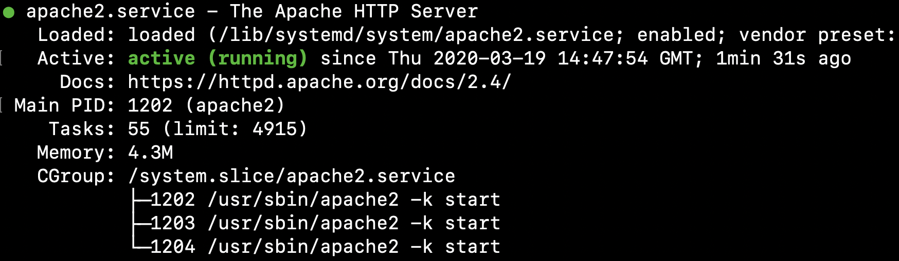
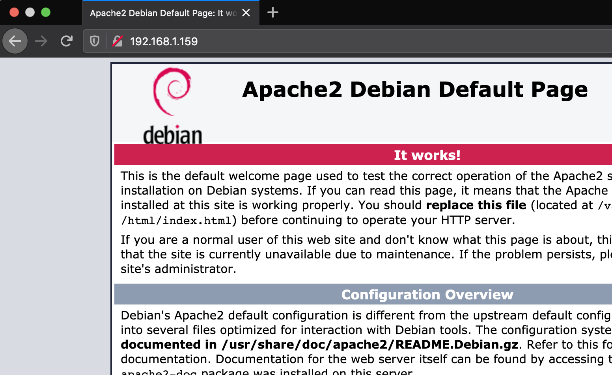

# Raspberry PI Webserver
## Introduction

I've been running a successful website on my Rapsberry PI for a number of years and I'm currently in the process of setting up another web server on a second PI, so I thought I would document how I get set up.

## Aims

At the end of this process you will have a running apache web server supporting:

- PHP
- Database
- HTTPS

## Table of Contents

1. [Requirements](#Requirements)
2. [Getting Started](#getting-started)
   1. [Raspberry PI](#Raspberry-PI)
   2. [SSH](#SSH)
3. [Installing Packages](#Installing-Packages)
   1. [Apache2](#Apache2)
   2. [PHP](#PHP)
   3. [MySQL](#MySQL--MariaDB)
   4. [CloudFlare](#CloudFlare)
4. [Portforwarding](#Portforwarding)

## Requirements

All you need to get started is a Raspberry PI and the ability to manage your hub!

## Getting Started

### Raspberry PI

If you're new to Raspberry PI's then I highly recommend following the set up guide on the [Raspberry PI Website](https://projects.raspberrypi.org/en/projects/raspberry-pi-setting-up). Please note: this guide sets-up using the GUI, but I will be sticking to the command line, therefore interacting with my PI through another device. Due to this, I set up my PI headless, which you can find out how to do here: https://www.raspberrypi.org/documentation/configuration/wireless/headless.md

### SSH

When interacting with your PI it can be much easier to do so remotely, rather than hooking up various peripherals each time. Therefore we will be using Secure Shell (SSH) to access our PI from another device. 

As well as entering commands on the command-line through SSH, you can use SFTP (which runs over SSH) to transfer files between your PI and your device through a client. I can recommend [MobaXterm](https://mobaxterm.mobatek.net/) for Windows and [CyberDuck](https://cyberduck.io/) for Mac but there are many more available so feel free to have a look around.

Please note: CyberDuck does not provide a command line so just use the Terminal on Mac.

More information on SSH on your PI can be found here: https://www.raspberrypi.org/documentation/remote-access/ssh/README.md.

## Installation

### [Apache2](https://httpd.apache.org/)

The actual HTTP web server software

```bash
sudo apt-get install apache2
```

You can check the web server is running with:

```bash
systemctl status apache2
```



Everything looks like it should be working! We can view the default web page in a browser by navigating to the address of the Raspberry PI on your network which can be found with `ifconfig`:



This is only assuming that your device and PI are on the same network. If not, we will discuss accessing your PI outside of its local network in the [Portforwarding](#Portforwarding) section later.

The website source files can be located at `/var/www/html`, to access this directory easily, I created a symlink, which is acts like a shortcut: `ln -s /var/www/html website`. I can then access the root directory of my website with `cd website`.

You can now start adding your website files! Once you upload a file, you can view the changes instantly by refreshing the page in your browser.

### [PHP](https://www.php.net/)

PHP is a scripting language that is executed server-side. Unlike Javascript, a client's browser does not download PHP files, but instead the server evaluates them and sends the result to the user. This is important for keeping sensitive information, such as database credentials or api keys, private and away from the eyes of users.

```bash
sudo apt-get install php libapache2-mod-php
```

You can check php is installed correctly with `php -v` which should return the current PHP version your PI is using.

### [MySQL / MariaDB](https://mariadb.org/)

Now for our database. We will be using MariaDB for our database managemenet system. This can be installed with the following command:

```bash
sudo apt-get install mariadb-server
```

Once installed, the database should be running. You can check this with `systemctl status mysql`. You can now setup and configure the database with:

```bash
sudo mysql_secure_installation
```

After configuration, you can access the database with `sudo mysql`. Be sure to set up database users to secure the database.

### [CloudFlare](https://www.cloudflare.com/)

As you are hosting from home, your webserver and network will be exposed to the world. CloudFlare provides many services for web sites including; Analytics, DNS, TLS (HTTPS), Caching, etc. CloudFlare will hide your public IP address  and instead the IP associated with your domain will be one of CloudFlare's.

CloudFlare also offers free SSL certificates for HTTPS for your website, as well as a TLS certificate to encrypt the connection between CloudFlare and your web server. This also ensures that users that wish to access your website must do so through CloudFlare therefore cannot bypass the services that they provide.

More information about SSL/TLS can be found here: https://support.cloudflare.com/hc/en-us/categories/200276247. 

## Portforwarding

This is how those outside your private network can access your web-server. When users enter your domain name into their browser, the domain will be resolved to it's IP address using a DNS server. This IP will then identify your home network, which starts with your hub or router which acts as the gateway to your network. Once a request reaches your hub, where should it go? You want it to be send to your PI which is the webserver. This is where portforwarding comes in...

Your router keeps track of which device on a network to send packets with a specified port number to. For a web-server, you want to forward HTTPS which run on port number 443.

Routers can manage portforwarding differently, so this website may be useful in finding out how you can do this: https://portforward.com/router.htm

## Other services

### [Fail2Ban](https://www.fail2ban.org/wiki/index.php/Main_Page)

After having your server up for a while, take a look at `/var/log/auth.log` to view all login attemps. If your reaction was something along the lines of "*who are these people and why would they want to access my server*" then you're just like me! After showing me this file, a friend recommended some software called **Fail2Ban** which tracks entries (IPs) in this log and automatically blacklists them when a certain number of failed attempts have occured.

Example log file, where an IP is banned after 5 failed attempts:

```
2020-03-19 07:12:31, [399]: INFO    [sshd] Found 109.177.45.33 - 2020-03-19 07:12:31
2020-03-19 07:32:55, [399]: INFO    [sshd] Found 45.139.186.52 - 2020-03-19 07:32:55
2020-03-19 07:32:55, [399]: INFO    [sshd] Found 45.139.186.52 - 2020-03-19 07:32:55
2020-03-19 07:32:57, [399]: INFO    [sshd] Found 45.139.186.52 - 2020-03-19 07:32:57
2020-03-19 07:35:22, [399]: INFO    [sshd] Found 45.139.186.52 - 2020-03-19 07:35:22
2020-03-19 07:35:22, [399]: INFO    [sshd] Found 45.139.186.52 - 2020-03-19 07:35:22
2020-03-19 07:35:22, [399]: NOTICE  [sshd] Ban 45.139.186.52
2020-03-19 07:35:24, [399]: INFO    [sshd] Found 45.139.186.52 - 2020-03-19 07:35:24
2020-03-19 13:21:13, [399]: INFO    [sshd] Found 14.161.6.201 - 2020-03-19 13:21:12
2020-03-19 13:21:13, [399]: INFO    [sshd] Found 14.161.6.201 - 2020-03-19 13:21:13
2020-03-19 13:21:14, [399]: INFO    [sshd] Found 14.161.6.201 - 2020-03-19 13:21:14
2020-03-19 13:21:15, [399]: INFO    [sshd] Found 14.161.6.201 - 2020-03-19 13:21:15
2020-03-19 16:01:54, [399]: INFO    [sshd] Found 186.210.172.233 - 2020-03-19 16:01:54
2020-03-19 16:01:54, [399]: INFO    [sshd] Found 186.210.172.233 - 2020-03-19 16:01:54
2020-03-19 16:01:56, [399]: INFO    [sshd] Found 186.210.172.233 - 2020-03-19 16:01:55
2020-03-19 16:02:01, [399]: INFO    [sshd] Found 186.210.172.233 - 2020-03-19 16:02:01
2020-03-19 16:02:01, [399]: INFO    [sshd] Found 186.210.172.233 - 2020-03-19 16:02:01
2020-03-19 16:02:01, [399]: NOTICE  [sshd] Ban 186.210.172.233
```

## Finishing off

Your basic web server is good to go, there are other things to look into such as `.htaccess` files or looking into configuring the apache web server more to suit your needs.

## Contributing

If I've missed anything or made any mistakes, please make any ammendments to improve this document and my knowledge :)
